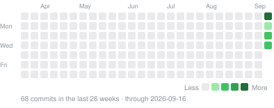
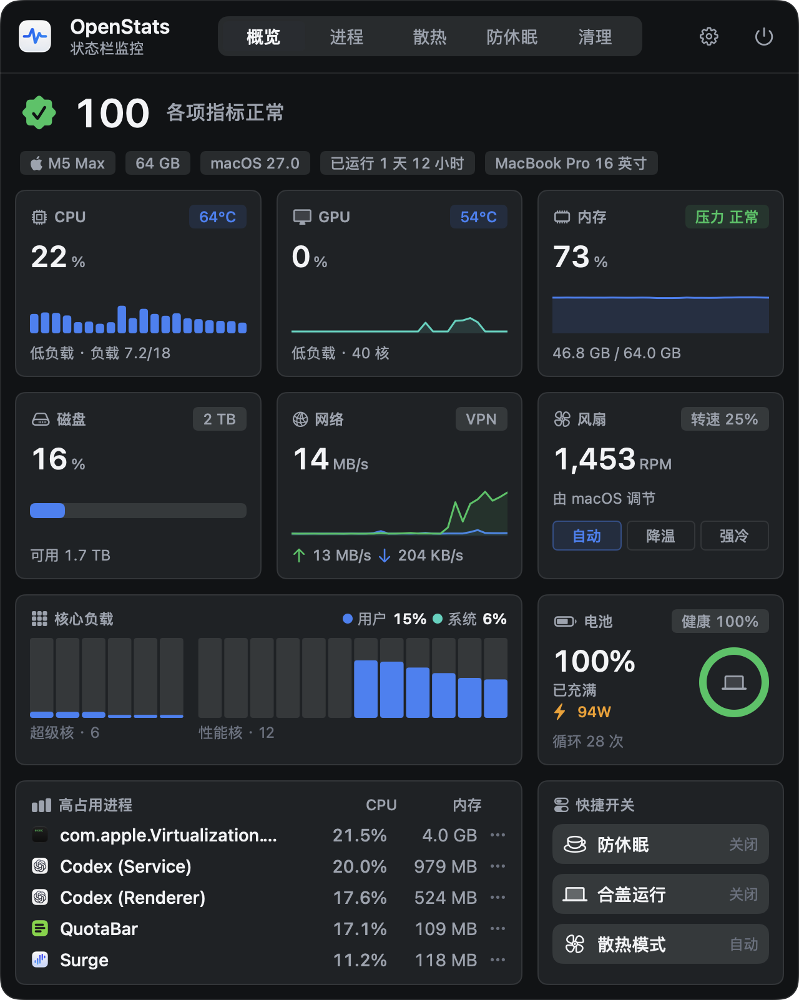
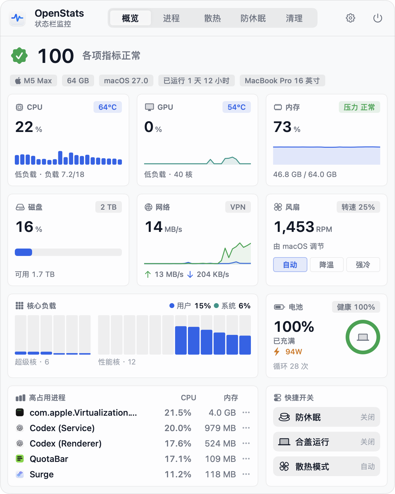
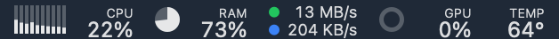
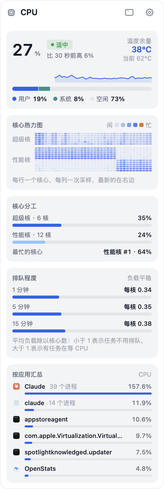
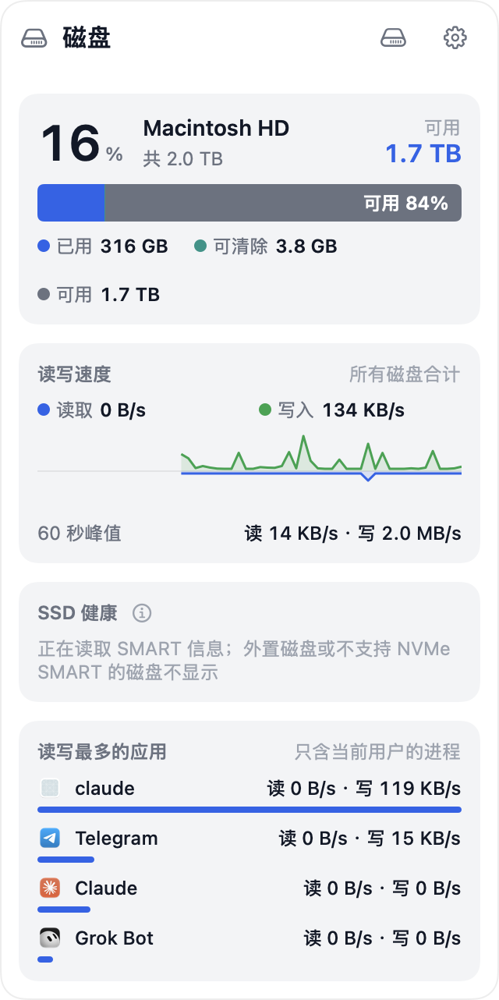
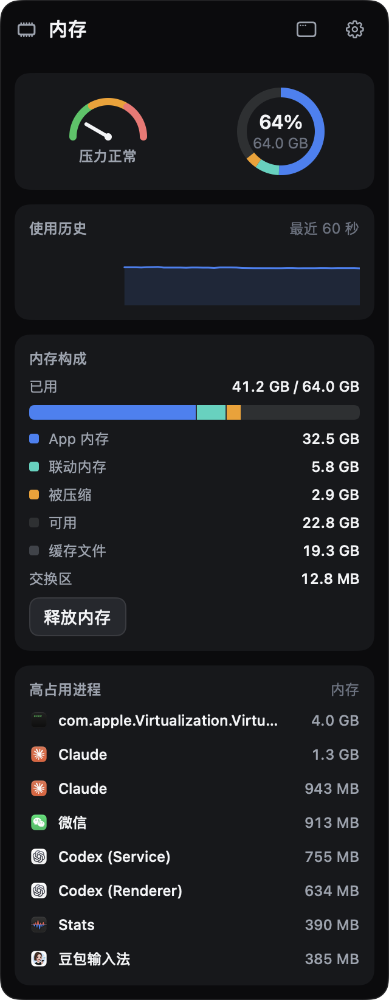
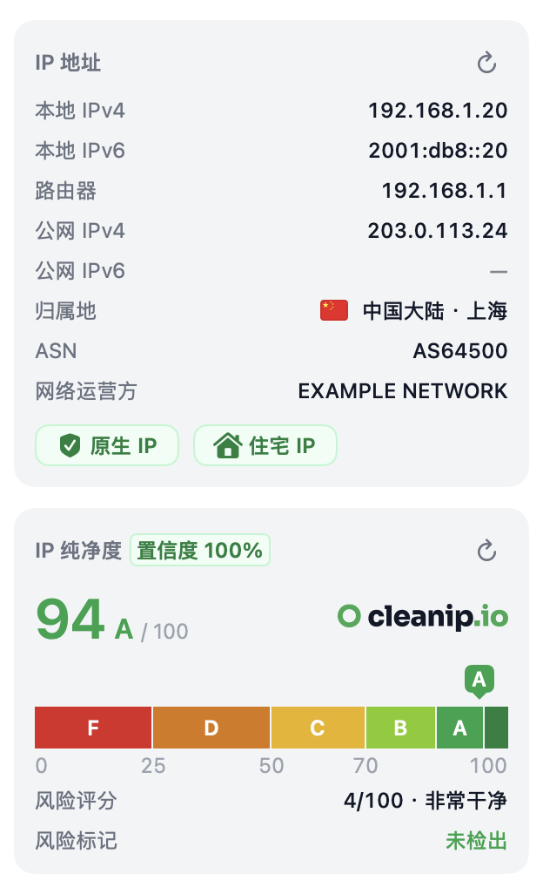
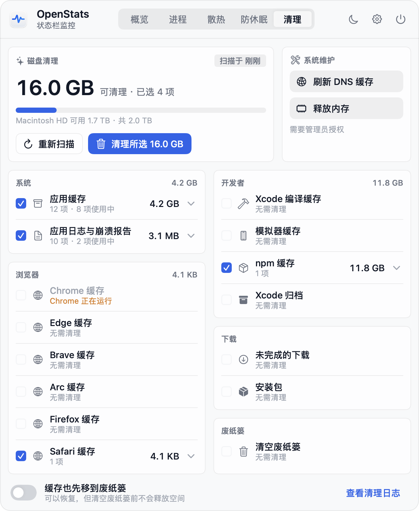
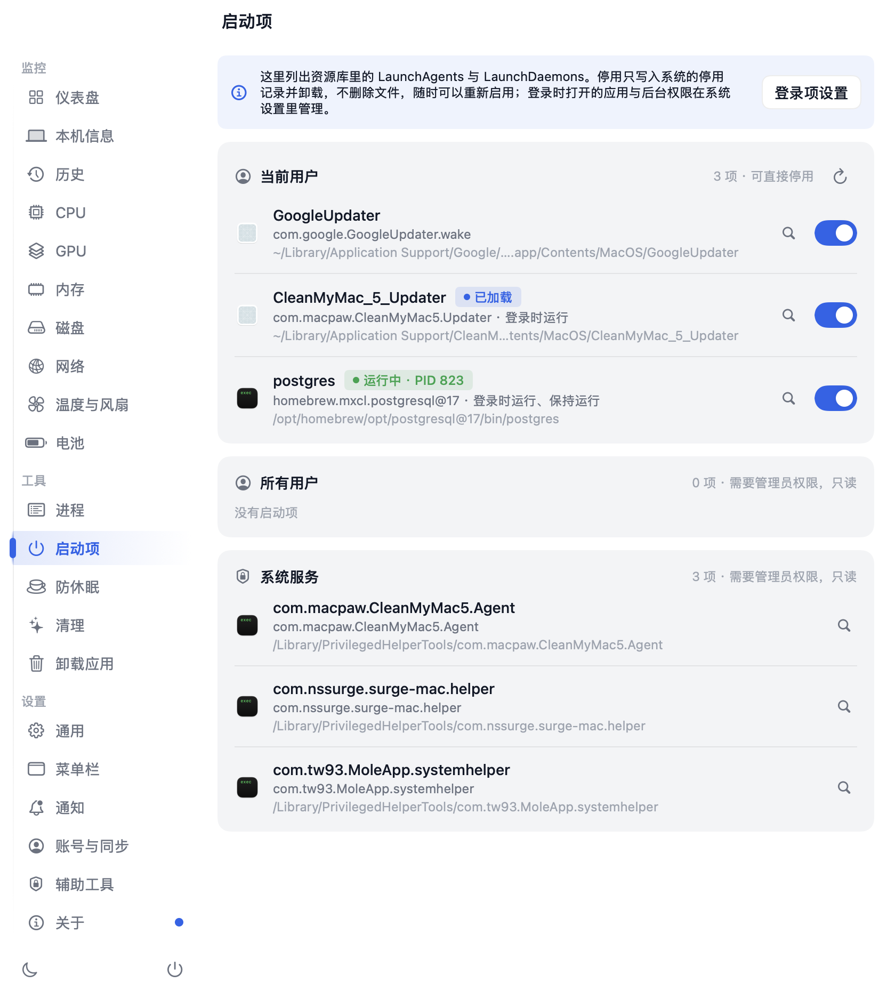

<div align="center">


# OpenStats

**Your Mac at a glance — CPU, GPU, memory, network and temperatures in the menu bar, with fan control, keep-awake, one-click cleanup, an app uninstaller and an IP cleanliness check.**

[](https://getopenstats.com/#download)
[](https://github.com/gentpan/OpenStats/stargazers)
[](https://github.com/gentpan/OpenStats/commits/main)
[](https://github.com/gentpan/OpenStats/graphs/commit-activity)
[](https://github.com/gentpan/OpenStats/actions/workflows/ci.yml)
[](https://getopenstats.com/#download)
[](LICENSE)

OpenStats is a macOS menu-bar app that shows what your Mac is doing right now — per-core
CPU load, GPU, memory pressure, network speed, disk, battery, temperatures and fans — and
lets you act on it: spin the fans up, keep the Mac awake with the lid closed, clear caches, fully
uninstall apps and disable startup items. Network details also check how clean your public IP is —
whether it is flagged as a VPN, proxy, data center or for abuse.
Everything is read on your own Mac, and there is no telemetry. An account is optional: sign in with GitHub, Google or Apple to sync your preferences to other Macs; the cloud keeps only your email, name and the settings document. Beyond that, the only network traffic comes from features you can turn off: a public-IP and cleanliness lookup when you open network details, a ping probe to a target you choose, and a daily check for a new version.

[Download](https://getopenstats.com/#download) ·
[Website](https://getopenstats.com) ·
[Changelog](CHANGELOG.md) ·
[Architecture](ARCHITECTURE.md)

**English** · [简体中文](README.zh-CN.md)

</div>

---

## Install

Download OpenStats 0.5.0 from the website (signed with a Developer ID certificate and notarized by Apple) —
pick the build for your Mac's chip:

| Chip | Download |
|---|---|
| Apple silicon (M1, M2, M3, M4, M5) | [OpenStats-0.5.0-AppleSilicon.dmg](https://getopenstats.com/download/OpenStats-0.5.0-AppleSilicon.dmg) |
| Intel | [OpenStats-0.5.0-Intel.dmg](https://getopenstats.com/download/OpenStats-0.5.0-Intel.dmg) |

Not sure? Apple menu › About This Mac says "Chip Apple M…" on Apple silicon and "Processor Intel…" on Intel.
Homebrew picks the right build for you:

```bash
brew install --cask gentpan/tap/openstats
```

Requires macOS 14 (Sonoma) or later. Developed and tested mainly on Apple silicon; on Intel Macs, Apple
Intelligence process explanations are unavailable, CPU cores are not split into performance and efficiency
groups, and some power and frequency readings may be missing. The interface is in English and Simplified Chinese, following the
system language by default; switch it in Settings → General → Language.

## Recent updates

<!-- changelog:start -->
<!-- Generated from CHANGELOG.md by Scripts/sync_changelog.py. Do not edit by hand. -->

Latest release **0.5.0** (2026-09-18) · **6** changes in development · [full changelog](CHANGELOG.md) (kept in Chinese)

<details open>
<summary><b>2026-09-18</b> · Unreleased · 5 added · 1 style</summary>

**Added**

- 新增出口与分流窗口：网络页顶栏和菜单栏网络弹窗各有一个入口。一次检测约十秒，看清 VPN 与代理有没有生效、各个网站分别从哪个出口出去。
- 一句话结论：分“未使用代理”“代理出口（地区）”“代理没有生效”“网络不通”四种情况，右侧给出经代理、直连、连不上的网站数量。
- 本机网络：显示物理网卡的出口 IP、归属地、运营商与 IPv6，归属地数据来自 cleanip.io。
- 网站分流：ChatGPT、Claude、YouTube、GitHub、哔哩哔哩等 25 个常用网站，按 AI、影音、社交、开发、国内分类筛选。接入 Cloudflare 的网站能实测出口与边缘节点，其余按国内 / 国际规则推断，每个网站带延迟信号条。
- 代理方式：列出 VPN / 隧道、系统代理、自动代理配置、DNS（被代理接管时会标出）与检测到的代理软件。

**Style**

- 菜单栏网络弹窗的 DNS 区块重排：网络服务与线路做成两个徽章（Wi-Fi / 有线、直连或经过哪个代理），走隧道时标题旁有叹号提示 DNS 可能被接管，刷新 DNS 缓存改为图标按钮。

</details>

<details>
<summary><b>2026-09-18</b> · 0.5.0 · 6 added</summary>

**Added**

- 新增网络测速窗口：网络页顶栏多一个“网络测速”按钮。窗口里四块内容各自独立，可以单独跑、也可以随时停，关窗即停。
- 本机宽带测速：下行、上行、空载延迟与抖动。数据由 speed.cloudflare.com 测量，并显示这次走的是哪个 Cloudflare 边缘节点。
- 国内分省三网延迟：31 个省份 × 三网共 93 个节点。给出电信、联通、移动各自的中位延迟与逐省数值；节点来自 zstaticcdn.com，只做 TCP 建连计时、不下载任何数据。
- 全球节点测速：24 个节点，先测延迟再单独测下载。覆盖亚太、欧洲、北美等地，测速文件来自 Linode、Vultr、DataPacket。
- 全球探针看目标：从全球 10 / 20 / 30 个社区探针 ping 你填的域名。看各地访问它的延迟与丢包，走 Globalping 的公开接口，请求从本机直接发出、不带任何密钥，用的是本机 IP 每小时的免费额度；测量结果在 Globalping 上公开，所以只测你自己填写的域名。
- 测速有明确的用量上限：默认 10 秒 / 200 MB，先到哪个停哪个。顶栏可改成 3 秒 / 20 MB 或 5 秒 / 50 MB，并实时显示本次用掉多少流量。

</details>

<details>
<summary><b>2026-09-17</b> · 0.5.0 · 1 changed</summary>

**Changed**

- 程序坞默认不再显示 OpenStats 图标：以前打开主窗口（比如从风扇弹窗进入温度与风扇页）时，图标会出现在程序坞与 ⌘Tab 里，关窗后才消失。现在和其他菜单栏工具一样始终只在菜单栏运行，主窗口照常打开并置于最前。想从程序坞或 ⌘Tab 切回主窗口的，可以在「设置 · 通用」打开“在程序坞显示图标”，开关立即生效。

</details>

<!-- changelog:end -->

## Activity

<p align="center">
  
</p>

<p align="center">
  <a href="https://star-history.com/#gentpan/OpenStats&Date">
    <picture>
      <source media="(prefers-color-scheme: dark)" srcset="https://api.star-history.com/svg?repos=gentpan/OpenStats&type=Date&theme=dark">
      
    </picture>
  </a>
</p>

## At a glance

<p align="center">
  
  
</p>

## Where the numbers show

**Menu bar**
- Eight styles, chosen once for every metric: two-line text, one-line text, icons, rings,
  pies, history bars, level meters and status dots. Any metric can be given its own style;
  Settings previews each one with sample data and says what the shape means.
- Network speed in two rows with dots or arrows, or on one line — green for upload, blue for
  download, always with its unit (`KB/s`, `MB/s`, `GB/s`).
- Small and consistent type: 7 pt labels over 10 pt figures, 11 pt on one line, 9 pt for
  network speed. Figures are fixed-width, so the bar does not jitter. Hover for every reading.

<p align="center"></p>

**Detail popovers** — each metric gets its own menu-bar item; click it for a narrow popover.
Choose which sections each popover shows in Settings. `Esc` closes it.
- **CPU.** Usage with a status and 30-second change, thermal headroom; a per-core heatmap; load by core type;
  queueing (load average per core, rising or falling); usage summed by app.
- **Memory.** What is still available with a pressure timeline; a waterline bar; memory saved by compression and
  live swap I/O; usage summed by app.
- **Network.** Traffic history; a connection-probe grid (green when reachable, red when not, last 60 pings); interface,
  Wi-Fi signal, VPN / proxy; local and public IPv4 / IPv6 with a flag, region and ASN; an IP cleanliness score with an F to A+
  grade and risk flags (VPN, proxy, Tor, data center, abuse); DNS flush
  and one-click switching to Cloudflare, Google, Tencent, Alibaba Cloud or manual servers;
  per-process traffic.
- **Disk.** Startup disk capacity as a segmented bar (used, purgeable, available); read / write speed with a
  60-second history; SSD health; the apps reading and writing the most.
- **GPU**, **Temperature & fans.** History, sensor groups, fan speeds and quick modes.
- **Battery.** Charge level, time remaining, adapter wattage and battery temperature; a 24-hour charge curve; power draw; health and cycle count; the batteries of connected Bluetooth devices (AirPods, Magic Keyboard / Mouse / Trackpad). Macs without a battery show the Bluetooth devices only.

<p align="center">
  
  
  
</p>

**IP cleanliness check** — see at a glance whether your public IP is clean: the CleanIP.io score with an F to A+ grade
band, a risk score and the risk flags it hits (VPN, proxy, Tor, data center, abuse history and more); the IP address
block marks native vs. broadcast and residential vs. data center with badges. IPv4 and IPv6 are checked separately,
and results are cached on the Mac for 7 days unless the address changes or you refresh.

<p align="center">
  
  
</p>

**Main window** — a sidebar with Dashboard, This Mac, History, CPU, GPU, Memory, Disk, Network, Temperature & fans,
Battery, plus the Processes, Startup items, Keep awake, Clean and Uninstall tools; resizable in both directions. See [Cleanup](#cleanup).

**Ask Apple Intelligence about a process** — right-click a process you don't recognise and the on-device
model explains what it is, whether its usage looks normal and whether it is safe to quit. No third-party AI and
no network; requires macOS 26 with Apple Intelligence turned on. Answers can be wrong — check before you quit anything.

White and blue in light mode, black and blue in dark mode — one look across windows and popovers,
switched with one click or following the system.

<p align="center">
  
  
</p>

## Fans and sleep

| Fan mode | What it does |
|---|---|
| Auto | Hands the fans back to macOS |
| Cool | Holds them at 60% between minimum and maximum speed |
| Max | Full speed |
| Custom | A slider, anywhere in the fan's range |

In Custom, the fans are handed back to macOS the moment the CPU reaches the safety
temperature (95 °C by default). Quitting OpenStats, or the app crashing, restores automatic
control. Running with the lid closed switches itself off on battery below a floor you choose.

Both need system privileges, provided by a small helper registered with `SMAppService` and
approved once in System Settings → General → Login Items. The helper offers a fixed set of
operations — set a fan's target speed, return fans to auto, toggle `pmset disablesleep`,
flush the DNS cache, purge memory — and **never runs arbitrary commands**. It checks the
caller's code signature, restores fans and sleep when the app disconnects, and after an
unclean exit restores them at the next boot.

## Cleanup

- **What it scans.** App caches, logs and crash reports, browser caches (Chrome, Edge,
  Brave, Arc, Firefox, Safari), Xcode DerivedData, simulator caches, the npm cache, Xcode
  archives, unfinished downloads, installers and the Trash.
- **Review first.** Sizes by category, every rule expandable to its items, a second click to
  confirm. Caches and logs are deleted outright so the space comes back at once; downloads go
  to the Trash. One switch sends everything to the Trash instead.
- **Safety.** Only allow-listed folders are ever touched. Keychains, password managers,
  VPNs, cookies and history are off limits. Caches of running apps are skipped, browsers must
  be quit first, and every item is checked again right before it goes. Each action is logged
  to `~/Library/Logs/OpenStats/cleanup.log`.
- **Maintenance.** Flush the DNS cache and purge memory — through the helper if it is
  installed, otherwise after a one-time administrator prompt.

<p align="center"></p>

## Uninstaller and startup items

- **Uninstall apps**: lists third-party apps in Applications with their size. Pick one or drop an app in, and OpenStats finds
  what it left in your Library — app data, caches, preferences, sandbox containers, saved window state, logs, web data and
  login items — each of which you can untick. Confirming moves everything, app included, to the Trash (restorable) and
  removes its Dock icon. Matching is by bundle identifier and same-named folders only; built-in and Apple apps are not
  listed, and running apps must be quit first.
- **Startup items**: lists LaunchAgents for the current user and all users, plus system LaunchDaemons, with the owning app,
  executable, whether it runs at login or is kept alive, and whether it is running, loaded or disabled. Your own items can
  be disabled or re-enabled in place (recorded in launchd's disabled list and unloaded, no files deleted); the rest are
  read-only, with a shortcut to the system Login Items settings.

<p align="center"></p>

## Your data

Metrics come from the kernel (`host_processor_info`, `host_statistics64`, `sysctl`), IOKit and the
SMC on your own Mac. Preferences live in the app's user defaults and contain nothing personal.
There is no analytics and no telemetry.

Every feature that touches the network can be turned off — the first two in Settings → Network, the update
check in Settings → About:

- **Public IP**: when you open network details, one request to Cloudflare `1.1.1.1` (ipify as fallback)
  for your public address, cached for 10 minutes. Location, ASN, network type and the cleanliness score
  come from `cleanip.io`, queried directly from each Mac with nothing but the public address and never
  through our servers; a result is kept for a week unless the address changes or you refresh.
- **Connection probe**: an ICMP ping to the target you pick (Cloudflare, Google, Alibaba Cloud,
  Tencent or your router) once a second while network details are open (every 10 seconds in the background), only while the network item is in the menu bar
  or network details are open.
- **Update check**: at launch and once a day, the app reads a version manifest from getopenstats.com — the
  manifest only. When a new version is out it asks; nothing installs without your click.

An account is optional and only syncs preferences after you sign in; it never carries monitoring data.

Process explanations run entirely on device through Apple Intelligence; process details never leave the Mac.

## Build & run

Requires macOS 14+, **Xcode 26 or later** (CommandLineTools
alone lacks the SwiftUI macro plugins) and [XcodeGen](https://github.com/yonaskolb/XcodeGen).

```bash
brew install xcodegen
make run                  # generate the project, build Debug and launch
make install              # build Release, install into /Applications and launch
make test                 # unit tests: metrics, SMC decoding, cleanup safety
make open                 # generate the project and open it in Xcode
```

The app is a menu-bar agent, so there is little to screenshot. Render the surfaces with
live data instead:

```bash
build/DerivedData/Build/Products/Debug/OpenStats.app/Contents/MacOS/OpenStats --snapshot ./snapshots
```

To measure the panel while it is open, launch with
`--show-panel`, which opens the panel and pins it.

After editing `CHANGELOG.md`, run `python3 Scripts/sync_changelog.py` to refresh the recent
updates above and the activity chart.

## Distribution

Developer ID only, not the App Store — the sandbox forbids talking to the SMC, reading other
apps' caches and installing a privileged helper, which is most of the feature set.

| What you have | What others get |
|---|---|
| Nothing | Ad-hoc signature — runs on your Mac only. Others see *"OpenStats is damaged"*. |
| Developer ID certificate | Hardened runtime. Others see *"Apple cannot check it for malicious software"*. |
| Certificate + notarization | Gatekeeper accepts it — the normal *"downloaded from the internet"* prompt. |

`make build` and `make install` sign with the first Developer ID Application certificate in
the keychain and fall back to ad-hoc without one. The helper reads its own team at run time
and accepts only callers signed by the same team.

```bash
make release                          # sign, notarize, staple, build the DMG and a Homebrew cask
NOTARY_PROFILE=OpenStats make release # use another notarytool keychain profile
SKIP_NOTARIZE=1 make release          # an unnotarized DMG for testing on this Mac only
```

`Scripts/release.sh` refuses to produce a DMG that Gatekeeper would still reject.

## Architecture

- `Packages/OpenStatsKit/Sources/SMC` — SMC reads and writes, fan control, temperature
  sensor discovery.
- `Packages/OpenStatsKit/Sources/Metrics` — samplers for CPU, memory, network, GPU, disk,
  battery, processes and sensors, and `MetricsHub`, which samples only what is on screen.
- `Packages/OpenStatsKit/Sources/Cleaner` — cleanup rules, the safety guard, scanning and
  cleaning.
- `Packages/OpenStatsKit/Sources/HelperShared` — the XPC protocol and maintenance commands.
- `Packages/OpenStatsKit/Sources/OpenStatsUI` — design tokens, the panel, settings and the
  menu-bar renderer.
- `Helper/` — the privileged helper and its launchd plist. `App/` — the entry point.

More in [ARCHITECTURE.md](ARCHITECTURE.md). Every change to the app is logged, dated, in
[CHANGELOG.md](CHANGELOG.md).

## Acknowledgements

OpenStats builds on these open-source projects. Thank you.

| Project | Author | License | What OpenStats took |
|---|---|---|---|
| [Stats](https://github.com/exelban/stats) | Serhiy Mytrovtsiy | MIT | SMC access, the Apple Silicon fan unlock sequence and the menu-bar mini widget metrics |
| [Mole](https://github.com/tw93/Mole) | tw93 | GPL-3.0 | Which folders are worth cleaning and which must never be touched; the cleaner is an independent Swift implementation and contains no Mole code |
| [QuotaBar](https://github.com/gentpan/quotabar) | GiantAccel, LLC | MIT | This README's layout, the changelog sync and the activity chart |

Details in [ThirdPartyNotices.md](ThirdPartyNotices.md).

OpenStats is an independent third-party app. It is not affiliated with, endorsed by, or
sponsored by Apple or any other company it mentions. Their names and logos belong to their
respective owners.

## License

MIT — see [LICENSE](LICENSE).
