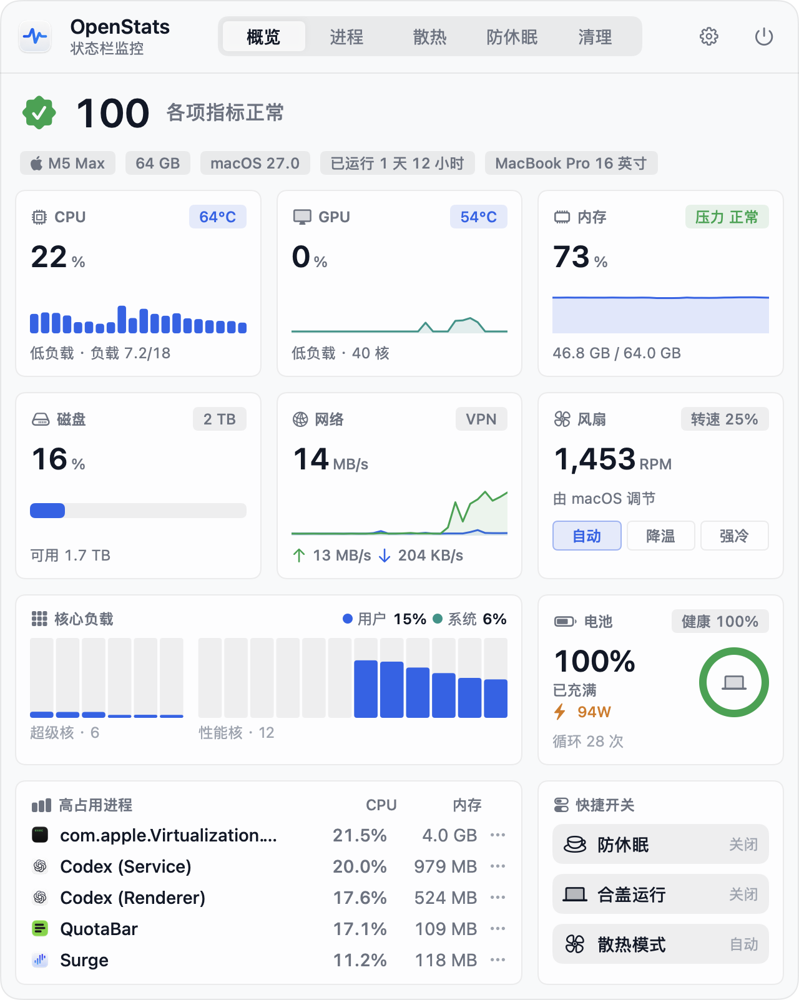
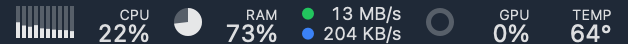
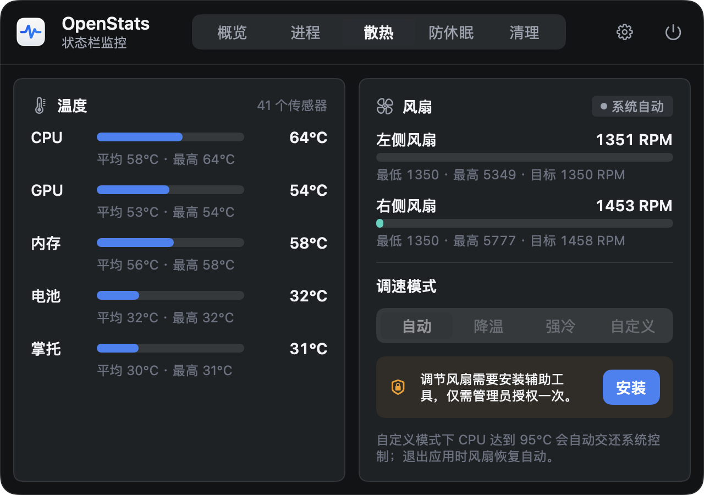
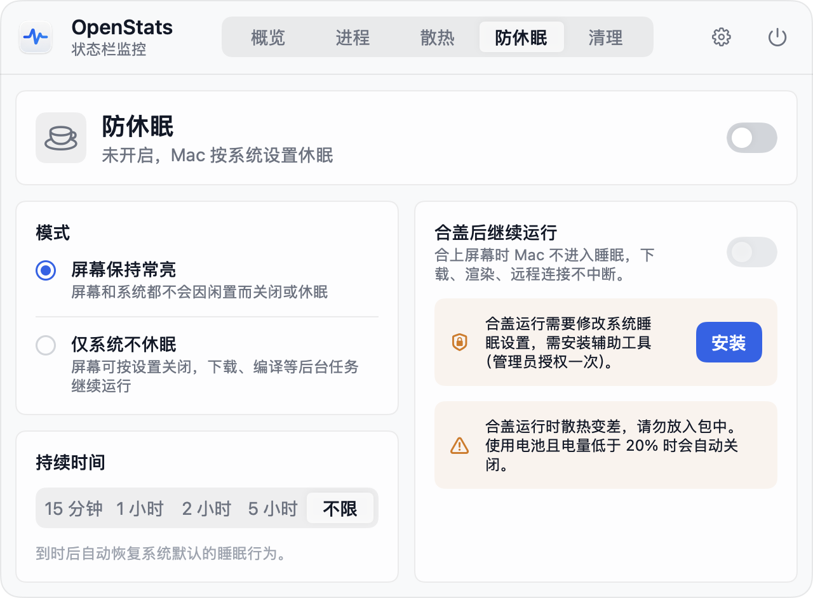
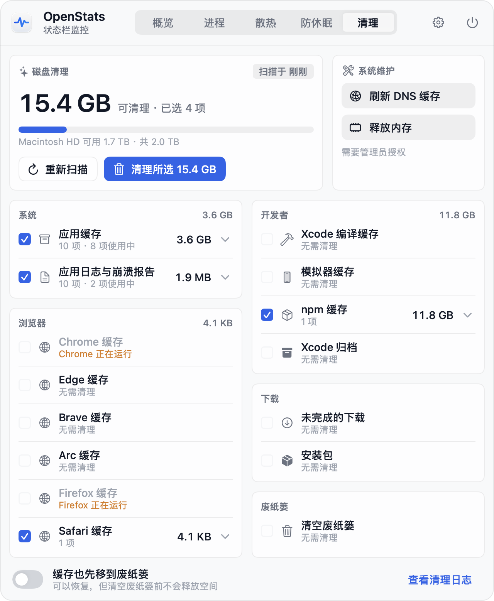
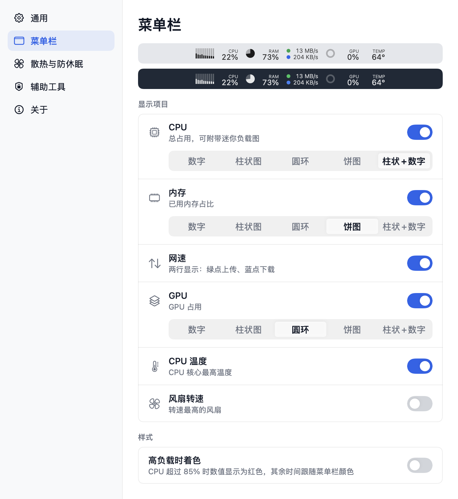

<p align="center">
  
</p>

<h1 align="center">OpenStats</h1>

<p align="center">
  <b>轻量、原生的 macOS 菜单栏系统监控</b><br>
  CPU · GPU · 内存 · 网络 · 磁盘 · 电池 · 温度 · 风扇调速 · 防休眠<br>
  <a href="https://getopenstats.com">getopenstats.com</a>
</p>

<p align="center">
  
  
  
  
</p>

<p align="center">
  
  
</p>

---

## 为什么做 OpenStats

市面上的菜单栏监控要么功能单一，要么常驻耗电。OpenStats 的目标很简单：

- **一眼看全**：点开菜单栏就是一整屏仪表盘，不用翻页、不用下拉。
- **足够省电**：面板收起时只采集菜单栏用到的指标，M5 Max 实测 **约 0.3% CPU、16 MB 内存**。
- **原生体验**：Swift 6 + AppKit + SwiftUI，macOS 26 起使用系统液态玻璃，跟随浅色 / 深色外观。

## 功能

### 菜单栏

<p></p>

| 指标 | 显示方式 |
|---|---|
| CPU / GPU / 内存 | 数字、柱状图、圆环、饼图、柱状图 + 数字，逐项可选 |
| 网速 | 两行显示：绿点上传、蓝点下载，完整单位（KB/s、MB/s、GB/s） |
| CPU 温度 / 风扇转速 | 迷你数值 |
| 防休眠 | 开启时显示咖啡杯图标 |

高负载时可选数值变红提醒；数值等宽右对齐，刷新时菜单栏不抖动。

### 面板

- **概览仪表盘**：健康评分、芯片 / 内存 / 系统 / 运行时长徽章，CPU 柱状历史、GPU 折线、内存面积图、磁盘、网络双线、风扇、各核心负载（超级核 / 性能核 / 能效核分组）、电池环形图、高占用进程、快捷开关。
- **进程**：按 CPU 或内存排序，辅助进程归并显示为所属应用。
- **散热**：CPU / GPU / 内存 / 电池 / 掌托温度；风扇实时转速与调速。
- **防休眠**：屏幕常亮、仅系统不休眠、**合盖后继续运行**，支持定时与低电量自动关闭。

<p align="center">
  
  
</p>

### 风扇调速

| 模式 | 行为 |
|---|---|
| 自动 | 交还 macOS 温控 |
| 降温 | 固定在最低到最高转速的 60% |
| 强冷 | 最高转速 |
| 自定义 | 滑块自由设定 |

安全机制：自定义模式下 CPU 达到设定温度（默认 95°C）自动交还系统控制；应用退出、崩溃或断开连接时风扇自动恢复。

### 清理与系统维护

- **一键扫描**：应用缓存、日志与崩溃报告、浏览器缓存（Chrome / Edge / Brave / Arc / Firefox / Safari）、Xcode 编译缓存、模拟器缓存、npm 缓存、Xcode 归档、未完成的下载、安装包、废纸篓。
- **先预览再清理**：按类别显示大小，可展开查看具体项目并在访达中定位；清理前二次确认。
- **安全边界**：只清理白名单目录；钥匙串、密码管理器、VPN、Cookie、历史记录一律不碰；正在运行的应用和浏览器自动跳过；执行前逐项重新校验；所有操作写入 `~/Library/Logs/OpenStats/cleanup.log`。
- **系统维护**：一键刷新 DNS 缓存、释放内存（已安装辅助工具时直接执行，否则请求一次管理员授权）。

<p></p>

### 设置

<p></p>

外观（跟随系统 / 浅色 / 深色）、登录时启动、刷新频率、温度单位、菜单栏显示项与样式、风扇安全温度、合盖模式电量下限。

## 技术实现

| 数据 | 来源 |
|---|---|
| CPU | `host_processor_info`，按 `hw.perflevelN` 区分核心类型 |
| 内存 | `host_statistics64`，口径与活动监视器一致；`kern.memorystatus_vm_pressure_level` |
| 网络 | `sysctl(NET_RT_IFLIST2)` 读取 64 位计数器（避免 `getifaddrs` 32 位回绕） |
| GPU | `IOAccelerator` 的 `PerformanceStatistics` |
| 温度 / 风扇 | AppleSMC；启动时枚举全部 SMC 键按前缀归类，**不硬编码芯片型号** |
| 进程 | `proc_pid_rusage`，CPU 时间与墙钟时间同用 mach 时间单位 |
| 电池 | `IOPowerSources` + `AppleSmartBattery` |

采集按界面需要分级：面板收起时只采菜单栏用到的指标；锁屏、屏幕休眠、系统睡眠时暂停。图表全部用 Canvas 自绘，面板关闭后立即销毁视图。

## 辅助工具与安全

风扇调速、“合盖后继续运行”、刷新 DNS 与释放内存需要系统权限，由 `SMAppService.daemon` 注册的辅助工具完成，首次使用时在“系统设置 › 通用 › 登录项”中批准一次。

- 只暴露固定的几个操作：设置风扇目标转速、恢复自动、切换 `pmset disablesleep`、刷新 DNS、释放内存，**不提供任意命令执行**。
- 通过 XPC 通信，并校验调用方代码签名。
- 客户端断开时自动恢复风扇与睡眠设置；异常退出后下次开机也会恢复。

## 安装

尚未发布正式版本。发布后将提供经过 Developer ID 签名与 Apple 公证的 DMG。

## 从源码构建

需要 Xcode 16 及以上，以及 [XcodeGen](https://github.com/yonaskolb/XcodeGen)：

```bash
brew install xcodegen
make run                 # 生成工程、编译并启动（Debug）
make run CONFIG=Release  # Release 构建
make test                # 单元测试
make snapshot            # 用本机实时数据渲染各页面截图到 build/snapshots
make open                # 生成并用 Xcode 打开工程
```

开发调试参数：

- `--snapshot <目录>`：输出面板、设置页、菜单栏的浅色 / 深色截图
- `--show-panel`：启动后展开并固定面板，用于测量面板打开时的资源占用

## 项目结构

```
App/                     应用入口与图标
Helper/                  root 辅助工具及其 launchd 配置
Packages/OpenStatsKit/
  Sources/SMC            SMC 读写、风扇控制、温度传感器归类
  Sources/Metrics        指标采集与分级调度（MetricsHub）
  Sources/HelperShared   XPC 协议与系统维护命令
  Sources/Cleaner        清理规则、安全守卫、扫描与执行引擎
  Sources/OpenStatsUI    设计 token、面板、设置窗口、菜单栏绘制
  Tests/                 单元测试（采集、SMC 编解码、清理安全边界）
project.yml              XcodeGen 工程描述
docs/PLAN.md             技术方案与调研记录
```

## 路线图

- [x] 菜单栏多指标与多种显示样式
- [x] 概览仪表盘、进程、散热、防休眠
- [x] 液态玻璃面板与浅色 / 深色主题
- [x] 风扇调速与合盖运行（辅助工具）
- [x] 缓存清理、刷新 DNS、释放内存
- [ ] 应用卸载（含残留文件与程序坞图标）
- [ ] 磁盘健康（SSD 寿命、写入量、温度）
- [ ] 点击菜单栏各指标弹出独立详情
- [ ] Developer ID 签名、公证与 DMG 发布
- [ ] Sparkle 自动更新
- [ ] 功耗、磁盘读写等更多指标
- [ ] 桌面小组件

## 致谢

SMC 通信与 Apple Silicon 风扇控制流程移植自 [exelban/stats](https://github.com/exelban/stats)（MIT License），详见 [ThirdPartyNotices.md](ThirdPartyNotices.md)。

## 许可证

待定。
