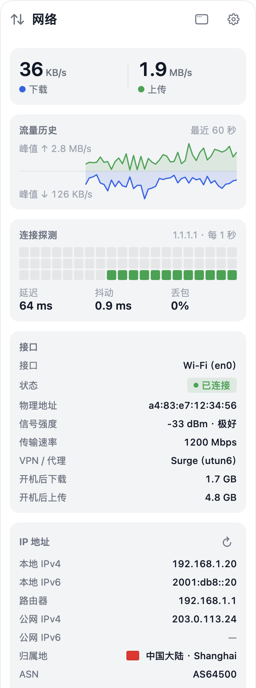

<div align="center">


# OpenStats

**Mac 的状态，抬眼就看见——CPU、GPU、内存、网络与温度常驻菜单栏，还能调风扇、防休眠、一键清理。**

[](https://getopenstats.com/#download)
[](https://github.com/gentpan/OpenStats/stargazers)
[](https://github.com/gentpan/OpenStats/commits/main)
[](https://github.com/gentpan/OpenStats/graphs/commit-activity)
[](https://github.com/gentpan/OpenStats/actions/workflows/ci.yml)
[](https://getopenstats.com/#download)
[](LICENSE)

OpenStats 是一款 macOS 菜单栏应用，实时显示 Mac 正在做什么：各核心 CPU 负载、GPU、内存压力、
网速、磁盘、电池、温度和风扇，并且可以直接处理：给风扇提速、合盖后继续运行、清理缓存。
所有数据都在你自己的 Mac 上读取，没有统计上报。账号是可选的：用 GitHub、Google 或 Apple 登录后可以把偏好设置同步到其他 Mac，云端只保存邮箱、姓名与设置文档。此外只有两项可关闭的网络功能会联网：打开网络详情时查询公网 IP，以及定时 ping 你选择的探测目标。

[下载](https://getopenstats.com/#download) ·
[官网](https://getopenstats.com) ·
[更新日志](CHANGELOG.md) ·
[架构说明](ARCHITECTURE.md)

[English](README.md) · **简体中文**

</div>

---

## 安装

从官网下载 [OpenStats 0.2.0](https://getopenstats.com/download/OpenStats-0.2.0.dmg)（Developer ID 签名、经过 Apple 公证），
或者用 Homebrew 安装：

```bash
brew install --cask gentpan/tap/openstats
```

需要 macOS 14（Sonoma）或更高版本。在 Apple Silicon 上开发和测试。
界面为简体中文。

## 最近更新

<!-- changelog:start -->
<!-- 由 Scripts/sync_changelog.py 从 CHANGELOG.md 生成，请勿手改。 -->

最新版本 **0.2.0**（2026-09-13） · 开发中 **50** 项改动尚未发布 · [完整更新日志](CHANGELOG.md)

<details open>
<summary><b>2026-09-15</b> · 未发布 · 新增 3 · 新增 2 · 调整 11 · 修复 4 · 新增 1</summary>

**新增**

- 菜单栏新增“电池”项目：电量按九种风格显示（电量条、圆环、饼图、数字等），充电中带闪电，电量低于 20% 按“高负载时着色”变红。点击弹出电池详情：电量与剩余 / 充满时间、适配器功率、电池温度、最近 24 小时电量曲线、功耗、健康度与循环次数、已连接蓝牙设备的电量（AirPods 左右耳与充电盒、妙控键盘 / 鼠标 / 触控板），可跳到系统电池设置；主窗口也有对应的“电池”页，历史页多了电池电量曲线。没有电池的 Mac（mini、Studio、iMac）上这个项目改为显示电量最低的蓝牙设备，弹窗只列蓝牙设备。「设置 · 菜单栏」新增“蓝牙设备电量低时提示”：某个设备低于 20% 时在电池项目旁显示它的图标与电量。
- 网络详情“接口”区块右上角新增重置按钮：把开机后下载 / 上传归零、从现在起重新累计，标题旁标出起算时间，两行改叫“重置后下载 / 上传”；重启后自动回到开机后累计，右键按钮可随时改回。
- 磁盘页从展示页变成能动手的磁盘工具，新增四张卡片：- 空间占用：统计家目录里每个文件夹占多少，并列出最大的 20 个文件（应用、照片图库等按整体算一个）；可在访达中显示，家目录里、Library 之外的文件可以直接移到废纸篓。只读扫描，文件多时需要几十秒，可随时停止。- 文件系统检查：调用系统的 diskutil 对启动盘做一次只读检查，相当于“磁盘工具”的急救但不修改任何东西；记住上次检查的时间与结果，发现问题时提示去磁盘工具修复。- 本地快照：列出 Time Machine 留在本机的快照（它们计入“可清除”空间），可一键全部删除；辅助工具够新时由它执行，否则请求一次管理员授权。辅助工具协议升到第 4 版，已安装的旧版会提示重新安装。- 其他磁盘：列出外置硬盘、U 盘、镜像与网络共享的容量，可在访达中显示或直接推出；接入、拔出时自动刷新。

**新增**

- 网络详情新增「IP 纯净度」区块：CleanIP.io 的纯净度评分与等级画成 F 到 A+ 的六段色带，得分处有标记；下面列出风险评分、命中的风险标记（VPN、代理、Tor、机房、滥用记录等）与一句评价，可打开完整报告。IP 地址区块也多了反向解析、网络类型与接入方式、IP 类型（住宅 / 机房）、原生 / 广播、住宅概率。
- 「设置 · 网络」新增归属地数据源选择：CleanIP.io（默认，信息最全、中文地名）、ipapi.is、DB-IP、ipinfo.io 或本地 GeoLite2 数据库；每一项都注明会把公网 IP 发给谁。在线数据源都由每台 Mac 自己直接查、不经过我们的服务器，同一个公网 IP 的结果会记住一段时间，收到限流后当天不再请求；切换数据源后立即重新查询。

**调整**

- 「设置 · 菜单栏」每个显示项目下面多了一行“菜单栏风格”：给这一项单独选一种风格（默认跟随整体，菜单里标出整体现在是哪种），旁边是这一项按当前风格、实时读数画出的预览，改了立刻能看到。以前这个选择藏在开关旁一个没有说明的下拉里，不容易发现。温度、风扇只提供文字类的三种风格；原“风格”分组改名“整体风格”并加了说明。
- 菜单栏弹窗右上角的两个按钮：左边改为该指标自己的图标（网络是网络图标、磁盘是硬盘），点了直接进主窗口里这个指标的页面；右边的齿轮进总设置。
- 网络详情的 IP 地址区块精简：原生 / 广播、住宅 / 机房、运营商类型（ISP 等）改为 cleanip.io 样式的徽章，去掉反向解析、网络类型、住宅概率、数据来源四行；数据来源改为标题后的小标记，CleanIP.io 显示它的字标：与标题文字同高、不留上下空白，点了打开 cleanip.io。徽章样式作为通用组件收进设计系统。
- 公网 IP 双栈支持：IPv4 与 IPv6 各自查询归属地与纯净度、各自缓存；两族都有时 IP 地址区块用胶囊开关切换 IPv4 / IPv6。纯净度区块的标题一行排开：地址族徽章（只有一族时不标）、置信度徽章（高绿、中灰、低黄）、完整报告链接，右侧是刷新按钮；IP 地址区块也有同样的刷新按钮，都是忽略缓存立即重查，查询进行中按钮变成系统的转圈。
- 公网 IP 的归属地结果保存在本机：点开网络详情立刻显示上次的结果，后台只向 Cloudflare 核对一下地址；地址没变且不满 7 天就不再查归属地，换了 IP、超过 7 天或点了刷新才重新查。
- 网络详情的纯净度色带占满整行，分数放到色带上方，同一行右侧是 cleanip.io 字标，点了打开这个 IP 的完整报告。
- 磁盘页与磁盘弹窗的“读取 / 写入”两组数值各占一半宽度，数字长短变化时位置不再左右挪动。
- 磁盘“读写最多的应用”与网络详情“高占用进程”改为稳定的 5 条榜单：按最近十几秒的平均速率排序和画条，数字仍是当前速率；刚安静下来的应用会在榜上停留几秒再退出，不再随每秒的波动忽隐忽现、上下乱跳。
- 磁盘页与磁盘弹窗的容量改为分段条：已用、可清除、可用三段按比例排在一条里，段内直接标名称与百分比，下方图例给出各自的容量；可清除是系统随时可以腾出的缓存，访达的“可用”把它算在内。
- 磁盘页“读写最多的应用”与 CPU、内存详情“按应用汇总”的排行条不再画灰色底槽，只保留代表相对占比的蓝色条。
- 「设置 · 菜单栏」的显示项目上方加了一条说明：按住 ⌘ 拖动可以调整菜单栏图标的顺序，新开启的项目由系统安排位置；各页面右上角的开关悬停时也有同样的提示。官网常见问题同步补充。

**修复**

- 网络详情的卡片被 IP 地址标题行撑宽、两侧几乎没有留白：标题、数据来源字标、IPv4 / IPv6 切换与刷新按钮一行放不下时字标自动缩小，切换胶囊也收窄了一点，卡片恢复与其他弹窗一致的边距。
- 菜单栏弹窗的内容整体偏左、右边留白更宽：接了鼠标时系统默认常驻滚动条，滚动区域给它预留了一条宽度。现在应用内一律用浮层滚动条，内容占满整个弹窗宽度，主窗口页面同样处理。
- 网络详情里的归属地国旗画错：中国、乌兹别克斯坦等 63 面旗子的 SVG 用了嵌套引用，系统渲染器画成一大块白。现在国旗改为预先渲染好的 PNG，全部按参考图核对过。
- 各监控页右上角的“在菜单栏显示”开关点不动：页面的滚动区域会自动向上延伸到顶栏底下，把开关的点击截走了；现在顶栏盖在滚动区域之上，GPU、磁盘等页面的开关可以正常点击。

**新增**

- 账号与设置同步（设置 · 账号与同步）：用 GitHub、Google 或 Apple 登录后，菜单栏项目与风格、刷新频率、外观与语言、详情弹窗的区块、连接探测、通知、快捷键、风扇安全温度、合盖电量下限会保存到 getopenstats.com，换一台 Mac 登录即自动恢复。设置改动 2 秒后上传，启动、唤醒与每 15 分钟检查一次云端；第一次登录时本机与云端都有内容且不同，会让你选用哪一份，之后以最后写入为准。登录走系统的授权窗口，令牌存在钥匙串，云端只保存邮箱、姓名与设置文档，可随时退出或删除云端数据。不登录时应用行为不变。

</details>

<details>
<summary><b>2026-09-15</b> · 未发布 · 新增 3 · 调整 5</summary>

**新增**

- CPU 走势时长可选 1 / 3 / 5 分钟：走势线上方一行小字切换，弹窗与主窗口共用；曲线按真实采样时间定位，最新一次采样固定在右边缘，睡眠等超过 10 秒没有采样的地方线条断开。
- 菜单栏新增“磁盘”项目：显示启动磁盘已用占比，八种风格都可用；点击弹出磁盘详情（容量与可用空间、读写速度、SSD 健康、读写最多的应用），区块可在设置里逐个隐藏。主窗口磁盘页右上角同样可以直接开关，“温度与风扇”页右上角现在有温度、风扇两个开关。
- CPU 详情新增“各核心占用”区块：主窗口里每个核心一个小圆环，中间写百分比，按“核心 1…N”编号并按类型分组，超过 60% 变橙、85% 变红；弹窗里是每核一根柱子的紧凑版，默认关闭，可在“设置 · 菜单栏”的 CPU 弹窗显示里打开。

**调整**

- 网络详情的 DNS 切换改为下拉菜单：“配置方式”一行直接是菜单，选 Cloudflare、Google 等预设立即切换，选“手动”展开输入框，自定义地址时旁边有铅笔按钮可再次修改；不再显示六个并排的按钮，省下两行。
- 卸载应用：去掉“同时从程序坞移除图标”开关，卸载时始终移除程序坞图标；应用列表的滚动条改为只在滚动时显示的细条（之前接了鼠标会显示一条粗的传统滚动条），升级说明里的滚动条同样修正。
- 主窗口的 CPU 走势图加上 0–100% 刻度与起点、中点、现在三个时间标签。
- CPU 详情的解释性文字不再常驻：热力图怎么看、每类核心是干什么的、平均负载怎么理解、按应用汇总为什么会超过 100%，都收进区块标题旁的 ⓘ，鼠标悬停 ⓘ 或卡片内容时才显示，界面上只留数据。
- 核心类型说人话：核心分工的悬停说明写明每类核心是干什么的（最快的处理重活、更省电的负责后台和轻量任务，系统自动分配）；各核心占用的分组标题、热力图的行标签都带上核心数量，热力图说明写明“每行一个核心（共 N 个），颜色越深越忙”；最忙的核心改为“核心 7（性能核）”这种统一编号。

</details>

<details>
<summary><b>2026-09-14</b> · 未发布 · 新增 2 · 调整 2</summary>

**新增**

- 系统通知新增“CPU 持续高负载”：总占用持续 1 分钟高于设定值（70% / 80% / 90%）时提醒，点通知打开 CPU 详情。
- 菜单栏风格新增“折线历史”：最近 30 次采样（约 1 分钟）的走势折线，线下填淡色；设置里有示例预览。

**调整**

- CPU 详情重新整理：顶部直接显示 CPU 温度（下方附离 100°C 的余量，不再把余量当主数值），走势线下标出最近 60 秒的峰值；核心热力图右侧加一根粗条画此刻各核心的占用；核心分工标出芯片型号，频率跟在占用后面用次要颜色显示；按应用汇总注明“以单核满载为 100%”，解释各应用相加为什么会超过顶部的总占用。
- 主窗口的 CPU 页：走势线加高并带 25% / 50% / 75% 参考线，核心分工与排队程度并排显示，不再整页单列拉长。

</details>

<!-- changelog:end -->

## 活跃度

<p align="center">
  
</p>

<p align="center">
  <a href="https://star-history.com/#gentpan/OpenStats&Date">
    <picture>
      <source media="(prefers-color-scheme: dark)" srcset="https://api.star-history.com/svg?repos=gentpan/OpenStats&type=Date&theme=dark">
      
    </picture>
  </a>
</p>

## 界面一览

<p align="center">
  
  
</p>

## 数据显示在哪里

**菜单栏**
- 八种风格整体选择、统一套用：双行文字、单行文字、图标、圆环、饼图、柱状历史、电量条、状态圆点；
  也可以给个别指标单独指定。设置里每种风格都有示例预览，并说明图形代表什么。
- 网速可选双行圆点、双行箭头或单行：绿色上传、蓝色下载，始终带单位（`KB/s`、`MB/s`、`GB/s`）。
- 字号小而统一：两行布局 7pt 标签加 10pt 数值，单行 11pt，网速 9pt；数值等宽，刷新时菜单栏不抖动。
  鼠标悬停显示完整读数。

<p align="center"></p>

**详情弹窗**——每个指标一个菜单栏图标，点击弹出该项的窄详情，显示哪些区块可在设置里勾选；按 `Esc` 关闭。
- **CPU**：占用与状态、与 30 秒前的变化、CPU 温度与余量、1 / 3 / 5 分钟走势；核心热力图与此刻各核心占用；核心分工与频率；排队程度（每核平均负载与趋势）；按应用汇总。
- **内存**：还可用多少与压力走势；内存水位条；压缩省下的内存与交换区读写；按应用汇总。
- **网络**：流量历史；连接探测格子（延迟、抖动、丢包）；接口、Wi-Fi 信号、VPN / 代理；本地与公网 IPv4 / IPv6，
  归属地国旗、ASN；DNS 一键刷新，一键切换 Cloudflare、Google、腾讯、阿里云或手动填写；各进程流量。
- **GPU**、**温度与风扇**：使用历史、各组温度、风扇转速与快捷模式。
- **电池**：电量与剩余 / 充满时间、适配器功率与电池温度；最近 24 小时电量曲线；功耗；健康度与循环次数；已连接蓝牙设备的电量（AirPods、妙控键盘 / 鼠标 / 触控板）。没有电池的 Mac 只显示蓝牙设备。

<p align="center">
  
  
  
</p>

**主窗口**——左侧边栏切换仪表盘、CPU、GPU、内存、网络、温度与风扇、电池、进程、防休眠、清理，宽高都可调整。
仪表盘有健康评分、芯片与系统徽章、三列指标卡片、核心负载、电池、高占用进程和快捷开关；清理见[清理](#清理)。

**用 Apple 智能解释进程**——看不懂的进程右键「用 Apple 智能解释」，由系统自带的本机大模型说明它是什么、占用是否正常、能否退出。
不接入第三方 AI，不联网；需要 macOS 26 并开启 Apple 智能，回答可能不准确，结束进程前请自行确认。

浅色为白底蓝色、深色为黑底蓝色，窗口与弹窗统一外观，可一键切换或跟随系统。

<p align="center">
  
  
</p>

## 风扇与睡眠

| 风扇模式 | 行为 |
|---|---|
| 自动 | 交还 macOS 温控 |
| 降温 | 固定在最低到最高转速之间的 60% |
| 强冷 | 最高转速 |
| 自定义 | 用滑块在风扇转速范围内自由设定 |

自定义模式下，CPU 一旦达到安全温度（默认 95°C）就交还系统控制。退出 OpenStats 或应用崩溃时，
风扇恢复自动。合盖运行在使用电池且电量低于你设定的下限时自动关闭。

这两项需要系统权限，由一个通过 `SMAppService` 注册的小型辅助工具完成，首次使用时在
“系统设置 › 通用 › 登录项”中批准一次。辅助工具只提供固定的几个操作：设置风扇目标转速、恢复自动、
切换 `pmset disablesleep`、刷新 DNS 缓存、释放内存，**不执行任意命令**。它会校验调用方的代码签名，
应用断开连接时恢复风扇与睡眠设置；异常退出后，下次开机也会恢复。

## 清理

- **扫描范围**：应用缓存、日志与崩溃报告、浏览器缓存（Chrome、Edge、Brave、Arc、Firefox、Safari）、
  Xcode 编译缓存、模拟器缓存、npm 缓存、Xcode 归档、未完成的下载、安装包和废纸篓。
- **先预览**：按类别显示大小，每条规则可展开查看具体项目，清理前再确认一次。缓存与日志直接删除，
  空间立即释放；下载目录的内容移到废纸篓。也可以一键改为全部先移到废纸篓。
- **安全**：只处理白名单目录。钥匙串、密码管理器、VPN、Cookie、历史记录一律不碰。正在运行的应用的缓存
  会跳过，浏览器需要先退出，删除前每一项都会再校验一次。所有操作记录在 `~/Library/Logs/OpenStats/cleanup.log`。
- **系统维护**：刷新 DNS 缓存、释放内存。已安装辅助工具时直接执行，否则请求一次管理员授权。

<p align="center"></p>

## 你的数据

指标来自本机的内核接口（`host_processor_info`、`host_statistics64`、`sysctl`）、IOKit 与 SMC。
偏好设置保存在应用自己的 user defaults 中，不含个人信息。没有任何统计与上报。

只有两项可选功能会联网，都可以在“设置 → 网络”中关闭：

- **公网 IP**：打开网络详情时向 Cloudflare `1.1.1.1`（回退 ipify）请求一次公网地址，10 分钟内不重复请求。归属地与 ASN 在本机的 MaxMind GeoLite2 数据库里查询；数据库从 `getopenstats.com` 下载并按 sha256 校验，下载前才临时改用 `ipapi.is` 的匿名接口在线查询：由每台 Mac 自己直接查、不经过我们的服务器，同一个公网 IP 的结果记住一天。
- **连接探测**：每 1、2 或 5 秒向你选择的目标（Cloudflare、Google、阿里云、腾讯或路由器）发送一次 ICMP ping，只在菜单栏显示网络项或打开网络详情时运行。

用 Apple 智能解释进程完全在本机完成，进程信息不会离开这台 Mac。

## 构建与运行

需要 macOS 14+、**Xcode 26 或更高版本**（仅有 CommandLineTools 时缺少 SwiftUI 宏插件）以及
[XcodeGen](https://github.com/yonaskolb/XcodeGen)。

```bash
brew install xcodegen
make run                  # 生成工程，编译 Debug 并启动
make install              # 编译 Release，安装到 /Applications 并启动
make test                 # 单元测试：指标采集、SMC 编解码、清理安全边界
make open                 # 生成工程并用 Xcode 打开
```

菜单栏应用没什么可截图的窗口，可以用本机实时数据渲染各个界面：

```bash
build/DerivedData/Build/Products/Debug/OpenStats.app/Contents/MacOS/OpenStats --snapshot ./snapshots
```

玻璃与半透明效果只在屏幕上存在。需要测量面板打开时的资源占用，用 `--show-panel` 启动，面板会自动展开并固定。

修改 `CHANGELOG.md` 后运行 `python3 Scripts/sync_changelog.py`，更新上方的“最近更新”和活跃度图。

## 分发

只走 Developer ID，不上 App Store——沙盒不允许访问 SMC、读取其他应用的缓存、安装特权辅助工具，
而这正是大部分功能。

| 你拥有的 | 别人打开时看到的 |
|---|---|
| 什么都没有 | ad-hoc 签名，只能在你自己的 Mac 上运行。别人会看到 *“OpenStats 已损坏”*。 |
| Developer ID 证书 | 启用 Hardened Runtime。别人会看到 *“Apple 无法检查其是否包含恶意软件”*。 |
| 证书 + 公证 | Gatekeeper 放行，只有常规的 *“从互联网下载”* 提示。 |

`make build` 与 `make install` 会自动使用钥匙串里的第一个 Developer ID Application 证书签名，没有证书时退回 ad-hoc。
辅助工具在运行时读取自己的签名团队，只接受同一团队签名的调用方。

```bash
make release                          # 签名、公证、装订，生成 DMG 与 Homebrew cask
NOTARY_PROFILE=OpenStats make release # 使用其他 notarytool 钥匙串凭据
SKIP_NOTARIZE=1 make release          # 生成未公证的 DMG，仅供本机测试
```

`Scripts/release.sh` 会拒绝生成 Gatekeeper 仍会拒绝的 DMG。

## 架构

- `Packages/OpenStatsKit/Sources/SMC`——SMC 读写、风扇控制、温度传感器发现。
- `Packages/OpenStatsKit/Sources/Metrics`——CPU、内存、网络、GPU、磁盘、电池、进程、传感器的采集器，
  以及只采集屏幕上需要的指标的 `MetricsHub`。
- `Packages/OpenStatsKit/Sources/Cleaner`——清理规则、安全守卫、扫描与执行。
- `Packages/OpenStatsKit/Sources/HelperShared`——XPC 协议与系统维护命令。
- `Packages/OpenStatsKit/Sources/OpenStatsUI`——设计 token、主窗口各页与设置页、详情弹窗、菜单栏绘制。
- `Helper/`——特权辅助工具及其 launchd 配置；`App/`——应用入口。

更多内容见 [ARCHITECTURE.md](ARCHITECTURE.md)。应用的每一项改动都按日期记录在 [CHANGELOG.md](CHANGELOG.md)。

## 致谢

OpenStats 基于以下开源项目，谢谢。

| 项目 | 作者 | 许可证 | OpenStats 借鉴了什么 |
|---|---|---|---|
| [Stats](https://github.com/exelban/stats) | Serhiy Mytrovtsiy | MIT | SMC 访问、Apple Silicon 风扇解锁流程、菜单栏迷你样式的字号参数 |
| [Mole](https://github.com/tw93/Mole) | tw93 | GPL-3.0 | 哪些目录值得清理、哪些绝对不能碰；清理模块为独立的 Swift 实现，不含 Mole 代码 |
| [QuotaBar](https://github.com/gentpan/quotabar) | GiantAccel, LLC | MIT | 本 README 的版式、更新日志同步与活跃度图脚本 |

详见 [ThirdPartyNotices.md](ThirdPartyNotices.md)。

OpenStats 是独立的第三方应用，与 Apple 及文中提到的其他公司没有隶属、认可或赞助关系。相关名称与标志归各自所有者所有。

## 许可证

MIT，见 [LICENSE](LICENSE)。
