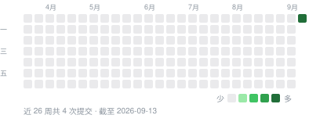

<div align="center">


# OpenStats

**Mac 的状态，抬眼就看见——CPU、GPU、内存、网络与温度常驻菜单栏，还能调风扇、防休眠、一键清理、卸载应用，检测 IP 纯净度。**

[](https://getopenstats.com/#download)
[](https://github.com/gentpan/OpenStats/stargazers)
[](https://github.com/gentpan/OpenStats/commits/main)
[](https://github.com/gentpan/OpenStats/graphs/commit-activity)
[](https://github.com/gentpan/OpenStats/actions/workflows/ci.yml)
[](https://getopenstats.com/#download)
[](LICENSE)

OpenStats 是一款 macOS 菜单栏应用，实时显示 Mac 正在做什么：各核心 CPU 负载、GPU、内存压力、
网速、磁盘、电池、温度和风扇，并且可以直接处理：给风扇提速、合盖后继续运行、清理缓存、彻底卸载应用、停用启动项；
网络详情还能检测公网 IP 的纯净度，看出出口是否被标记为 VPN、代理、机房或有滥用记录。
所有数据都在你自己的 Mac 上读取，没有统计上报。账号是可选的：用 GitHub、Google 或 Apple 登录后可以把偏好设置同步到其他 Mac，云端只保存邮箱、姓名与设置文档。此外会联网的只有几项可关闭的功能：打开网络详情时查询公网 IP 与纯净度、定时 ping 你选择的探测目标，以及每天检查一次新版本。

[下载](https://getopenstats.com/#download) ·
[官网](https://getopenstats.com) ·
[更新日志](CHANGELOG.md) ·
[架构说明](ARCHITECTURE.md)

[English](README.md) · **简体中文**

</div>

---

## 安装

从官网下载 OpenStats 0.3.2（Developer ID 签名、经过 Apple 公证），按 Mac 的芯片选择：

| 芯片 | 下载 |
|---|---|
| Apple 芯片（M1、M2、M3、M4、M5 系列） | [OpenStats-0.3.2-AppleSilicon.dmg](https://getopenstats.com/download/OpenStats-0.3.2-AppleSilicon.dmg) |
| Intel 芯片 | [OpenStats-0.3.2-Intel.dmg](https://getopenstats.com/download/OpenStats-0.3.2-Intel.dmg) |

不确定是哪种，看苹果菜单 › 关于本机：写着“芯片 Apple M…”是 Apple 芯片，写着“处理器 Intel…”是 Intel。
也可以用 Homebrew 安装，会自动选对版本：

```bash
brew install --cask gentpan/tap/openstats
```

需要 macOS 14（Sonoma）或更高版本。主要在 Apple 芯片上开发和测试；Intel 机型上不能用 Apple 智能解释进程，
CPU 不分性能核与能效核，部分功耗与频率读数可能不显示。
界面支持简体中文与 English，默认跟随系统语言，可在“设置 · 通用 · 语言”中切换。

## 最近更新

<!-- changelog:start -->
<!-- 由 Scripts/sync_changelog.py 从 CHANGELOG.md 生成，请勿手改。 -->

最新版本 **0.3.2**（2026-09-16） · 开发中 **8** 项改动尚未发布 · [完整更新日志](CHANGELOG.md)

<details open>
<summary><b>2026-09-16</b> · 未发布 · 修复 1 · 调整 1 · 样式 5 · 新增 1</summary>

**修复**

- 网络弹窗偶尔差一点放不下、露出一小截滚动条：弹窗打开时按当时的内容算高度，之后公网 IP、归属地等数据陆续到达，内容变高了窗口却不跟着变。现在内容一变高或变矮，窗口高度随之调整到正好放下，只有屏幕放不下时才出现滚动条；展开、收起区块时同样适用。

**调整**

- CPU 弹窗与主窗口 CPU 页的“按应用汇总”、仪表盘的“高占用进程”，CPU 改为占整机的比例：全部核心跑满为 100%，和顶部的总占用是同一把尺子。以前按单核满载为 100% 计（活动监视器的算法），多核 Mac 上一个应用动不动显示 99%、75%，容易误以为很吃 CPU；鼠标悬停在数值上仍可看到单核口径的数值。进程页保持单核口径，与活动监视器一致。

**样式**

- 主窗口在 macOS 26 上改用液态玻璃：侧边栏是一块浮在窗口里的玻璃面板，红绿灯按钮落在面板里，选中项垫一块淡蓝色圆角底并随切换滑动；顶栏右侧“在菜单栏显示”一组收进玻璃胶囊。主按钮是蓝色玻璃胶囊、次要按钮与图标按钮是透明玻璃，风扇模式等快捷切换是玻璃胶囊，开关换成系统开关（拖动时滑块变成玻璃）。设置分组与数据卡片保持实色，与系统设置一致。macOS 14、15 上保持原来的样式。
- 菜单栏弹窗改为紧凑排版，参照 Stats：区块不再是灰底卡片，改成一条细分隔线隔开，行距收紧，顶栏按钮缩小；网络弹窗的 IP 纯净度与 DNS 默认收起成一行（纯净度显示分数与等级，DNS 显示正在使用的地址），点一下展开、标题栏右侧的箭头收起，状态会记住；流量图变矮，连接探测改为两行细格。网络弹窗从约 1520pt 降到约 950pt，其他弹窗矮了一到两成。主窗口的详情页保持原样，照常完整显示。
- IP 纯净度的标题行重新排版：置信度不再是带框的绿色徽章，改成标题旁一行浅灰小字，百分比按高低着色；“查看完整报告”文字链接换成外链图标，与刷新、收起并成一组按钮，macOS 26 上合成一颗玻璃胶囊。分数右侧的 cleanip.io 字标照旧可以打开完整报告。
- 连接探测只用来看网络通不通：格子通了是绿色、不通是红色（不再用橙色表示延迟偏高），固定 60 格，弹窗排成 3 行、主窗口排成 2 行；去掉格子下面的延迟、抖动、丢包三项，标题右侧也不再写探测地址与频率。打开网络详情时固定每秒探测一次，「设置 · 网络」里的“探测间隔”选项随之去掉，后台低频探测仍是每 10 秒。
- 分段切换改为苹果标准样式：灰色圆角底槽，各段等宽铺满，选中的一段是实心蓝色、白字，切换时蓝块滑过去；网络详情的 IPv4 / IPv6 切换同样是灰底蓝选中。

**新增**

- 全局加载框：清理、卸载应用、导出诊断信息、修改 DNS 进行中，整个主窗口压暗，中间浮一块加载框写明正在做什么（macOS 26 上是液态玻璃），期间不能误点其他操作，完成后自动消失。

</details>

<details>
<summary><b>2026-09-16</b> · 0.3.2 · 修复 2</summary>

**修复**

- 修复网络详情里 IP 纯净度查不到的问题：之前一直显示“正在查询”、IP 地址区块只剩国家，因为 cleanip.io 不再接受查询指定 IP，改为只查请求方自己的出口。现在分别锁定 IPv4 与 IPv6 连接各查一次，两族仍然各有自己的归属地与纯净度；锁定地址族的连接建不起来时退回系统默认的请求方式。用了分流代理、cleanip.io 看到的出口与 Cloudflare 看到的不同时，以 cleanip.io 看到的地址显示，纯净度与地址对得上。
- 修复查询失败后纯净度长时间空着：空结果不再被当成有效结果保存 7 天，没查到的下次打开网络详情就会重查，服务恢复后纯净度不会一直空着。

</details>

<details>
<summary><b>2026-09-15</b> · 0.3.1 · 新增 2</summary>

**新增**

- 支持 Intel 芯片的 Mac：分别发布 Apple 芯片版与 Intel 版安装包，官网与 Homebrew 按芯片提供下载（Homebrew 自动选择）。Intel 机型需要 macOS 14 Sonoma 或更高版本；用 Apple 智能解释进程只能在 Apple 芯片上使用，Intel 机型的 CPU 不分性能核与能效核，部分功耗与频率读数可能不显示。
- 在线升级按芯片下载对应的安装包，并在安装前核对安装包支持这台 Mac 的芯片；在 Apple 芯片上经 Rosetta 运行的 Intel 版会升级为 Apple 芯片版。

</details>

<!-- changelog:end -->

## 活跃度

<p align="center">
  
</p>

<p align="center">
  <a href="https://star-history.com/#gentpan/OpenStats&Date">
    <picture>
      <source media="(prefers-color-scheme: dark)" srcset="https://api.star-history.com/svg?repos=gentpan/OpenStats&type=Date&theme=dark">
      
    </picture>
  </a>
</p>

## 界面一览

<p align="center">
  
  
</p>

## 数据显示在哪里

**菜单栏**
- 八种风格整体选择、统一套用：双行文字、单行文字、图标、圆环、饼图、柱状历史、电量条、状态圆点；
  也可以给个别指标单独指定。设置里每种风格都有示例预览，并说明图形代表什么。
- 网速可选双行圆点、双行箭头或单行：绿色上传、蓝色下载，始终带单位（`KB/s`、`MB/s`、`GB/s`）。
- 字号小而统一：两行布局 7pt 标签加 10pt 数值，单行 11pt，网速 9pt；数值等宽，刷新时菜单栏不抖动。
  鼠标悬停显示完整读数。

<p align="center"></p>

**详情弹窗**——每个指标一个菜单栏图标，点击弹出该项的窄详情，显示哪些区块可在设置里勾选；按 `Esc` 关闭。
- **CPU**：占用与状态、与 30 秒前的变化、CPU 温度与余量、1 / 3 / 5 分钟走势；核心热力图与此刻各核心占用；核心分工与频率；排队程度（每核平均负载与趋势）；按应用汇总。
- **内存**：还可用多少与压力走势；内存水位条；压缩省下的内存与交换区读写；按应用汇总。
- **网络**：流量历史；连接探测格子（通了是绿格、不通是红格，最近 60 次）；接口、Wi-Fi 信号、VPN / 代理；本地与公网 IPv4 / IPv6，
  归属地国旗、ASN；IP 纯净度评分与 F 到 A+ 等级、风险标记（VPN、代理、Tor、机房、滥用记录）；DNS 一键刷新，一键切换 Cloudflare、Google、腾讯、阿里云或手动填写；各进程流量。
- **磁盘**：启动磁盘容量分段条（已用、可清除、可用）；读写速度与 60 秒走势；SSD 健康；读写最多的应用。
- **GPU**、**温度与风扇**：使用历史、各组温度、风扇转速与快捷模式。
- **电池**：电量与剩余 / 充满时间、适配器功率与电池温度；最近 24 小时电量曲线；功耗；健康度与循环次数；已连接蓝牙设备的电量（AirPods、妙控键盘 / 鼠标 / 触控板）。没有电池的 Mac 只显示蓝牙设备。

<p align="center">
  
  
  
</p>

**IP 纯净度检测**——网络详情里直接看出口 IP 干不干净：CleanIP.io 纯净度评分与 F 到 A+ 等级色带，风险评分与命中的
风险标记（VPN、代理、Tor、机房、滥用记录等）；IP 地址区块用徽章标出原生 / 广播、住宅 / 机房。IPv4 与 IPv6 分别检测，
结果在本机缓存 7 天，换了 IP 或点刷新才重查。

<p align="center">
  
  
</p>

**主窗口**——左侧边栏切换仪表盘、本机信息、历史、CPU、GPU、内存、磁盘、网络、温度与风扇、电池，以及进程、启动项、防休眠、清理、卸载应用几个工具，宽高都可调整。
仪表盘有健康评分、芯片与系统徽章、三列指标卡片、核心负载、电池、高占用进程和快捷开关；清理见[清理](#清理)。

**用 Apple 智能解释进程**——看不懂的进程右键「用 Apple 智能解释」，由系统自带的本机大模型说明它是什么、占用是否正常、能否退出。
不接入第三方 AI，不联网；需要 macOS 26 并开启 Apple 智能，回答可能不准确，结束进程前请自行确认。

浅色为白底蓝色、深色为黑底蓝色，窗口与弹窗统一外观，可一键切换或跟随系统。

<p align="center">
  
  
</p>

## 风扇与睡眠

| 风扇模式 | 行为 |
|---|---|
| 自动 | 交还 macOS 温控 |
| 降温 | 固定在最低到最高转速之间的 60% |
| 强冷 | 最高转速 |
| 自定义 | 用滑块在风扇转速范围内自由设定 |

自定义模式下，CPU 一旦达到安全温度（默认 95°C）就交还系统控制。退出 OpenStats 或应用崩溃时，
风扇恢复自动。合盖运行在使用电池且电量低于你设定的下限时自动关闭。

这两项需要系统权限，由一个通过 `SMAppService` 注册的小型辅助工具完成，首次使用时在
“系统设置 › 通用 › 登录项”中批准一次。辅助工具只提供固定的几个操作：设置风扇目标转速、恢复自动、
切换 `pmset disablesleep`、刷新 DNS 缓存、释放内存，**不执行任意命令**。它会校验调用方的代码签名，
应用断开连接时恢复风扇与睡眠设置；异常退出后，下次开机也会恢复。

## 清理

- **扫描范围**：应用缓存、日志与崩溃报告、浏览器缓存（Chrome、Edge、Brave、Arc、Firefox、Safari）、
  Xcode 编译缓存、模拟器缓存、npm 缓存、Xcode 归档、未完成的下载、安装包和废纸篓。
- **先预览**：按类别显示大小，每条规则可展开查看具体项目，清理前再确认一次。缓存与日志直接删除，
  空间立即释放；下载目录的内容移到废纸篓。也可以一键改为全部先移到废纸篓。
- **安全**：只处理白名单目录。钥匙串、密码管理器、VPN、Cookie、历史记录一律不碰。正在运行的应用的缓存
  会跳过，浏览器需要先退出，删除前每一项都会再校验一次。所有操作记录在 `~/Library/Logs/OpenStats/cleanup.log`。
- **系统维护**：刷新 DNS 缓存、释放内存。已安装辅助工具时直接执行，否则请求一次管理员授权。

<p align="center"></p>

## 卸载应用与启动项

- **卸载应用**：列出“应用程序”里的第三方应用及其体积，选中或把应用拖进来，找出它留在资源库里的应用数据、缓存、
  偏好设置、沙盒容器、窗口状态、日志、网页数据和登录启动项，可逐项取消勾选；确认后连同应用一起移到废纸篓（可放回），
  并从程序坞移除图标。只匹配应用包名与同名目录，系统自带和 Apple 的应用不列出，正在运行的应用会提示先退出。
- **启动项**：列出当前用户、所有用户的 LaunchAgents 和系统 LaunchDaemons，显示所属应用、可执行文件、是否登录时运行 /
  保持运行，以及运行中、已加载、已停用状态。当前用户的启动项可以直接停用或重新启用（写入 launchd 停用记录并卸载，
  不删除文件），其余只读，并提供系统登录项设置的入口。

<p align="center"></p>

## 你的数据

指标来自本机的内核接口（`host_processor_info`、`host_statistics64`、`sysctl`）、IOKit 与 SMC。
偏好设置保存在应用自己的 user defaults 中，不含个人信息。没有任何统计与上报。

会联网的功能都可以关闭。前两项在“设置 → 网络”中，检查更新在“设置 · 关于”中：

- **公网 IP**：打开网络详情时向 Cloudflare `1.1.1.1`（回退 ipify）请求一次公网地址，10 分钟内不重复请求。归属地、ASN、网络类型与纯净度评分由这台 Mac 直接向 `cleanip.io` 查询，只发送公网地址、不经过我们的服务器；地址没变、不满 7 天就沿用上次结果，点刷新才重查。
- **连接探测**：打开网络详情时每秒（后台每 10 秒）向你选择的目标（Cloudflare、Google、阿里云、腾讯或路由器）发送一次 ICMP ping，只在菜单栏显示网络项或打开网络详情时运行。
- **检查更新**：启动时与之后每天向 getopenstats.com 读取一次版本清单，只下载清单本身；发现新版本时提示，由你决定是否安装。

账号是可选的，只在登录后同步偏好设置，不含任何监控数据。

用 Apple 智能解释进程完全在本机完成，进程信息不会离开这台 Mac。

## 构建与运行

需要 macOS 14+、**Xcode 26 或更高版本**（仅有 CommandLineTools 时缺少 SwiftUI 宏插件）以及
[XcodeGen](https://github.com/yonaskolb/XcodeGen)。

```bash
brew install xcodegen
make run                  # 生成工程，编译 Debug 并启动
make install              # 编译 Release，安装到 /Applications 并启动
make test                 # 单元测试：指标采集、SMC 编解码、清理安全边界
make open                 # 生成工程并用 Xcode 打开
```

菜单栏应用没什么可截图的窗口，可以用本机实时数据渲染各个界面：

```bash
build/DerivedData/Build/Products/Debug/OpenStats.app/Contents/MacOS/OpenStats --snapshot ./snapshots
```

需要测量面板打开时的资源占用，用 `--show-panel` 启动，面板会自动展开并固定。

修改 `CHANGELOG.md` 后运行 `python3 Scripts/sync_changelog.py`，更新上方的“最近更新”和活跃度图。

## 分发

只走 Developer ID，不上 App Store——沙盒不允许访问 SMC、读取其他应用的缓存、安装特权辅助工具，
而这正是大部分功能。

| 你拥有的 | 别人打开时看到的 |
|---|---|
| 什么都没有 | ad-hoc 签名，只能在你自己的 Mac 上运行。别人会看到 *“OpenStats 已损坏”*。 |
| Developer ID 证书 | 启用 Hardened Runtime。别人会看到 *“Apple 无法检查其是否包含恶意软件”*。 |
| 证书 + 公证 | Gatekeeper 放行，只有常规的 *“从互联网下载”* 提示。 |

`make build` 与 `make install` 会自动使用钥匙串里的第一个 Developer ID Application 证书签名，没有证书时退回 ad-hoc。
辅助工具在运行时读取自己的签名团队，只接受同一团队签名的调用方。

```bash
make release                          # 签名、公证、装订，生成 DMG 与 Homebrew cask
NOTARY_PROFILE=OpenStats make release # 使用其他 notarytool 钥匙串凭据
SKIP_NOTARIZE=1 make release          # 生成未公证的 DMG，仅供本机测试
```

`Scripts/release.sh` 会拒绝生成 Gatekeeper 仍会拒绝的 DMG。

## 架构

- `Packages/OpenStatsKit/Sources/SMC`——SMC 读写、风扇控制、温度传感器发现。
- `Packages/OpenStatsKit/Sources/Metrics`——CPU、内存、网络、GPU、磁盘、电池、进程、传感器的采集器，
  以及只采集屏幕上需要的指标的 `MetricsHub`。
- `Packages/OpenStatsKit/Sources/Cleaner`——清理规则、安全守卫、扫描与执行。
- `Packages/OpenStatsKit/Sources/HelperShared`——XPC 协议与系统维护命令。
- `Packages/OpenStatsKit/Sources/OpenStatsUI`——设计 token、主窗口各页与设置页、详情弹窗、菜单栏绘制。
- `Helper/`——特权辅助工具及其 launchd 配置；`App/`——应用入口。

更多内容见 [ARCHITECTURE.md](ARCHITECTURE.md)。应用的每一项改动都按日期记录在 [CHANGELOG.md](CHANGELOG.md)。

## 致谢

OpenStats 基于以下开源项目，谢谢。

| 项目 | 作者 | 许可证 | OpenStats 借鉴了什么 |
|---|---|---|---|
| [Stats](https://github.com/exelban/stats) | Serhiy Mytrovtsiy | MIT | SMC 访问、Apple Silicon 风扇解锁流程、菜单栏迷你样式的字号参数 |
| [Mole](https://github.com/tw93/Mole) | tw93 | GPL-3.0 | 哪些目录值得清理、哪些绝对不能碰；清理模块为独立的 Swift 实现，不含 Mole 代码 |
| [QuotaBar](https://github.com/gentpan/quotabar) | GiantAccel, LLC | MIT | 本 README 的版式、更新日志同步与活跃度图脚本 |

详见 [ThirdPartyNotices.md](ThirdPartyNotices.md)。

OpenStats 是独立的第三方应用，与 Apple 及文中提到的其他公司没有隶属、认可或赞助关系。相关名称与标志归各自所有者所有。

## 许可证

MIT，见 [LICENSE](LICENSE)。
